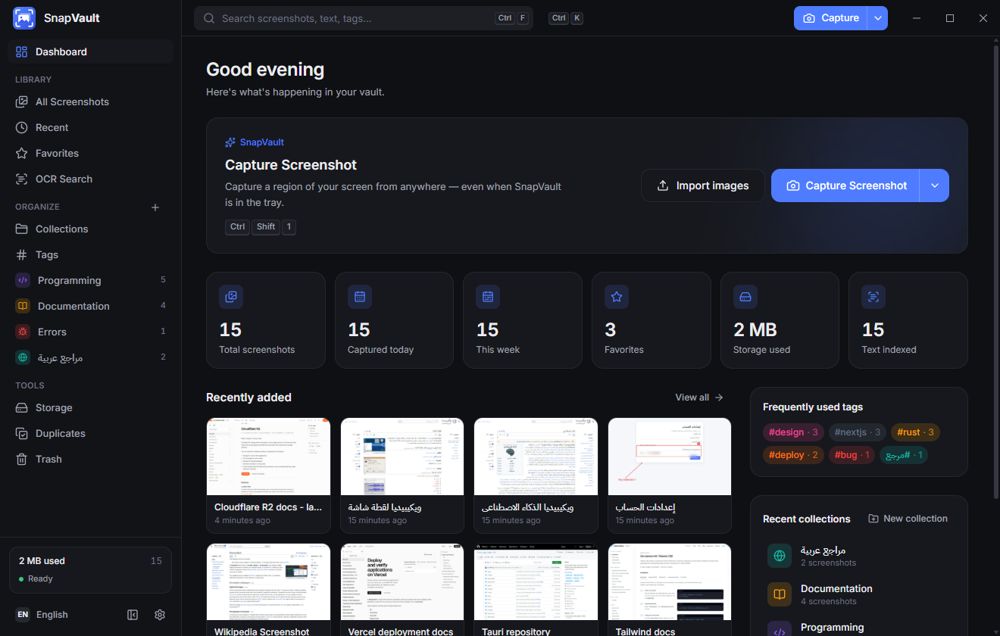
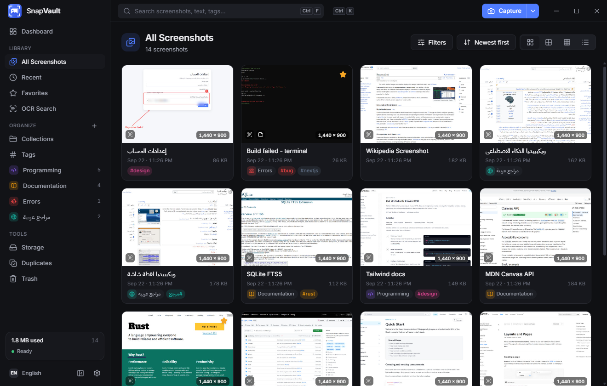
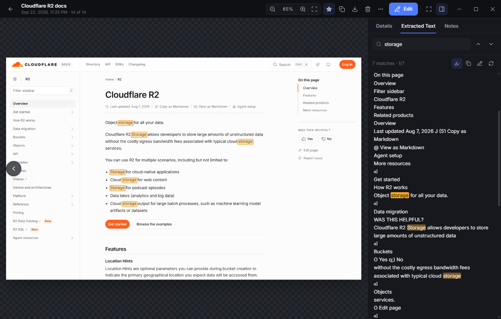
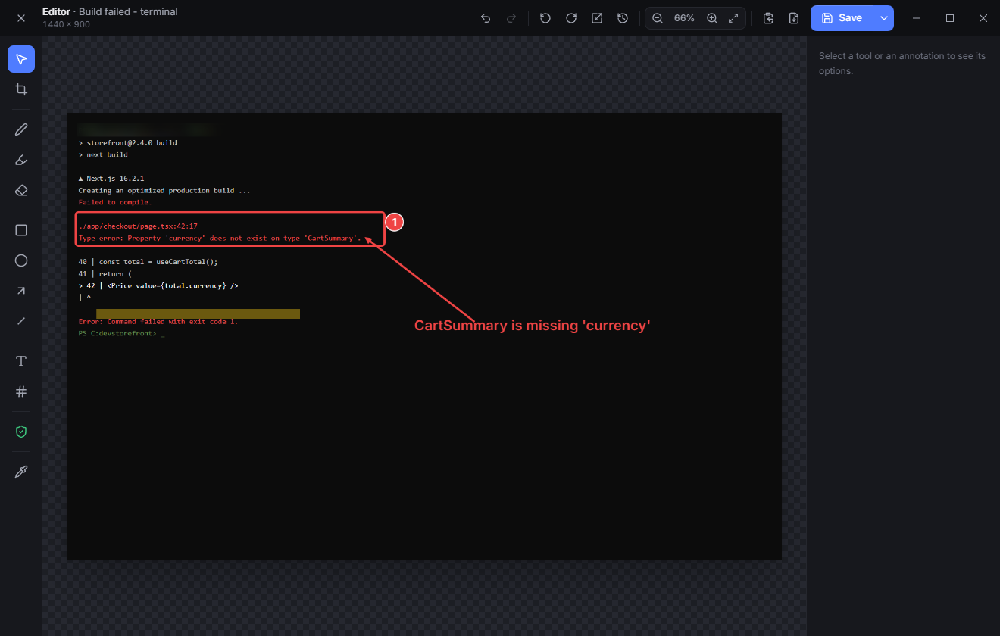
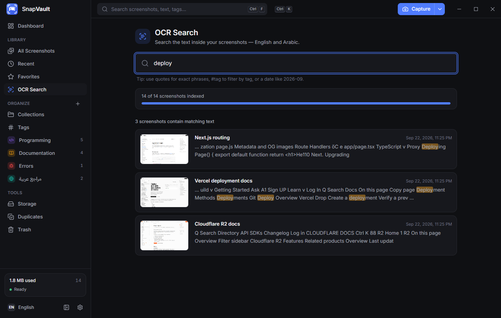
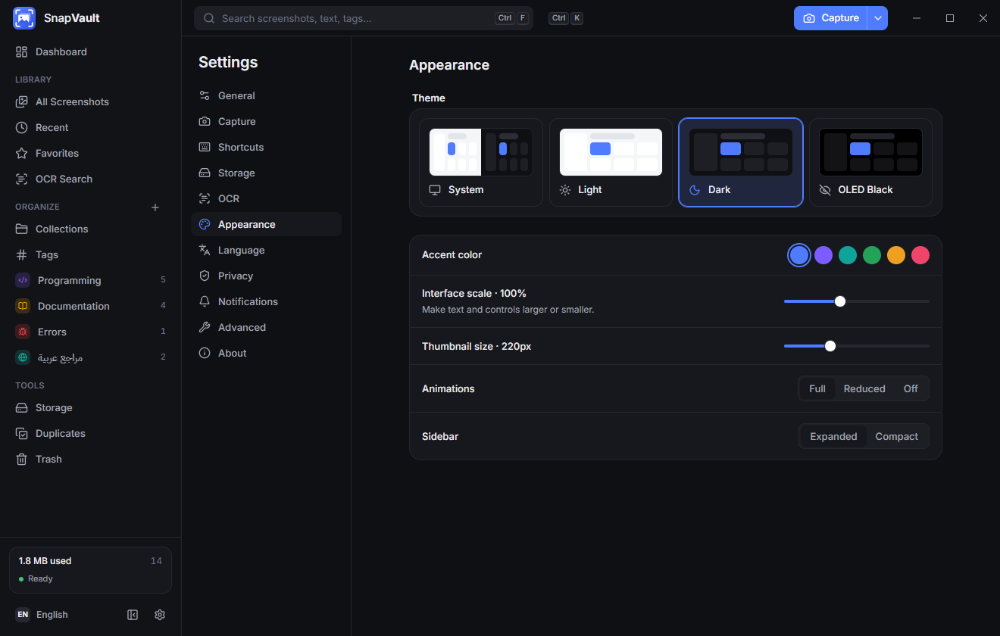
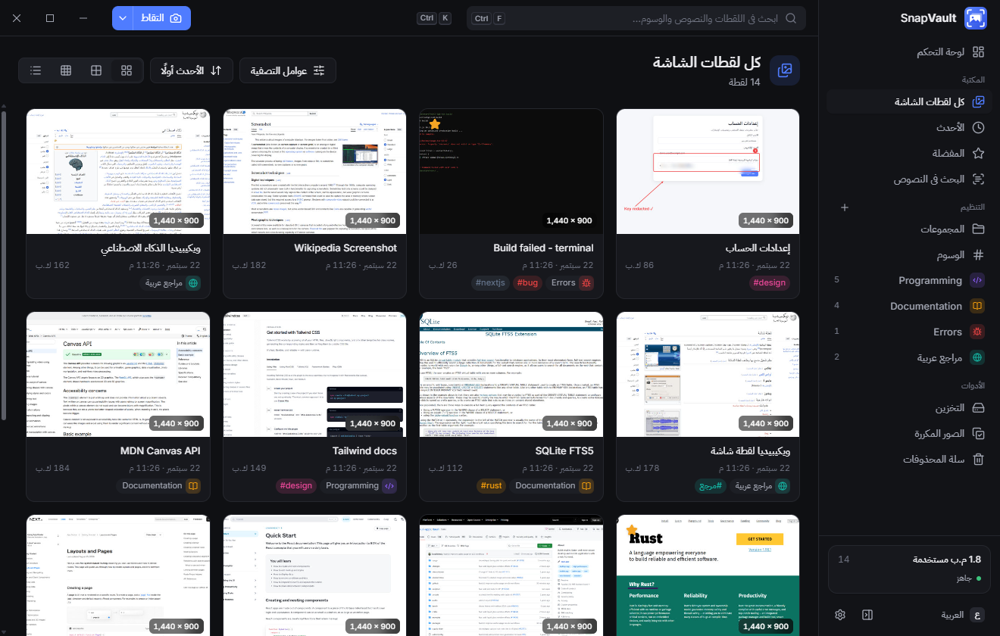

<p align="center">
  
</p>

<h1 align="center">SnapVault</h1>

<p align="center">
  <strong>A local-first screenshot manager for Windows.</strong><br />
  Capture, organize, annotate, redact and search every screenshot — in English and Arabic — without anything leaving your PC.
</p>

<p align="center">
  
  
  
  
</p>

<p align="center">
  
</p>

---

## Overview

Windows scatters screenshots across `Pictures\Screenshots`, the Desktop, Downloads and the clipboard. SnapVault turns them into a searchable library: it captures regions, windows and screens with global shortcuts, imports screenshots from folders you choose, reads the text inside every image with the **built-in Windows OCR engine**, and gives you collections, tags, notes, an annotation editor with redaction tools, and fast full-text search.

Everything runs locally. There are no accounts, no uploads and no telemetry.

## Features

**Capture**
- Region capture with a frozen full-screen overlay, live `W × H` readout, pixel magnifier, resize handles, arrow-key nudging and quick actions (Save · Copy · Edit · Cancel)
- Window picking (hover to highlight, click to capture), active-window capture, full screen (monitor under the cursor, primary, or all monitors), a specific monitor, and delayed capture with an on-screen countdown
- Multi-monitor aware — regions can span monitors; the source monitor is stored with each capture
- Configurable global shortcuts (defaults `Ctrl+Shift+1/2/3`), optional mouse cursor, PNG/JPG/WEBP with quality control
- After-capture behavior: save, copy only, save + copy, or open the editor; a small preview popup with Copy / Edit / Open / Delete

**Library**
- Grid, large grid, compact grid and list views, virtualized and paged so tens of thousands of screenshots stay smooth
- Cards show preview, date, time, resolution, size, favorite, collection, tags and OCR status; hover actions and a full right-click menu
- Multi-select (click, `Ctrl`/`Shift`, checkboxes, `Ctrl+A`) with bulk favorite, move, tag/untag, export, OCR and delete
- Keyboard navigation (arrows, `Enter`, `Space`, `Delete`, `F`, `E`, `Ctrl+C`) that respects RTL
- Collections with custom icons and colors, unlimited colored tags, favorites, personal notes

**Search**
- SQLite FTS5 full-text search over file names, OCR text, notes, tags and collection names
- Prefix matching (`cloud` finds *Cloudflare*), `"exact phrases"`, `#tag` filters and date tokens (`2026-09`, `2026-09-22`)
- Arabic-aware normalization: hamza forms, alef maqsura, taa marbuta, tashkeel and tatweel are folded, so `فاتوره الانترنت` finds `فاتورةُ الإنترنت`
- Filters for today / yesterday / this week / this month / custom range, favorites, with or without text, large screenshots, collections, tags and minimum dimensions
- A dedicated OCR Search page with highlighted snippets; matches are highlighted in the text panel **and directly on the image**

**Viewer**
- Zoom (wheel, `+`/`-`, `0` fit, `1` actual size), pan, full screen, next/previous within the list you opened it from
- Details (tags, collection, full metadata: dates, resolution, format, size, path, source monitor, capture mode, OCR status), Extracted Text (copy, select, find, edit, re-run) and Notes (autosaved, searchable)
- Revert an edited screenshot to its original

**Editor**
- Crop, resize, rotate, pen, highlighter, rectangle, circle, arrow, line, text (with Arabic RTL shaping), numbered markers, eraser, color picker (eyedropper), undo/redo, zoom, reset
- Stroke color, width, opacity, font size, font family, alignment, fills; selecting an annotation lets you move, resize and restyle it
- **Privacy tool**: blur, pixelate or blackout. Redactions are rendered into the pixels (blur is applied on a down-sampled copy), so the saved or exported file contains nothing recoverable
- Save keeping the original, save as a new screenshot, or save and send the original to the Recycle Bin. Extracted text of the old image is discarded and OCR re-runs on the redacted version, so hidden details don't linger in the search index

**Organization & maintenance**
- Watched folders (e.g. `Pictures\Screenshots`) import new images automatically once they finish writing; files stay where they are
- Drag and drop images or folders onto the window; `snapvault.exe <files…>` also imports (useful for a "Send to" shortcut)
- Duplicate detection (SHA-256) and similar-image detection (256-bit difference hash); keep all, keep one, compare side by side or ignore — nothing is ever deleted automatically
- Storage overview: totals, by collection, by month, largest and oldest screenshots, and a cleanup tool that only moves items to Trash
- Trash with restore, permanent delete and optional auto-empty (never / 7 / 30 / 60 / 90 days, default never). Permanently deleted files go to the **Windows Recycle Bin**
- Export single screenshots, selections or whole collections as PNG, JPG or WEBP with configurable quality

**Desktop integration**
- System tray (capture modes, open, pause folder monitoring, settings, quit; double-click to open)
- Close-to-tray, optional launch at sign-in (off by default, starts minimized), single instance, remembered window size/position/monitor
- Native Windows notifications (per-event toggles), command palette (`Ctrl+K`), custom frameless window with Windows-style controls
- Light, dark, OLED black and system themes; six accent colors; UI scale; thumbnail size; animation level; compact sidebar
- Full English and Arabic interface with right-to-left layout, switchable instantly

## Screenshots

| | |
|---|---|
|  **Library** |  **Viewer with OCR highlighting** |
|  **Editor** |  **OCR Search** |
|  **Settings** |  **Arabic (RTL)** |

## Technology

| Layer | Technology |
|---|---|
| Shell | [Tauri 2](https://tauri.app) (WebView2), single ~10 MB executable |
| Backend | Rust — GDI screen capture, `Windows.Media.Ocr`, SQLite via `rusqlite` (bundled, FTS5), `image`, `libwebp`, `notify`, `arboard`, `trash` |
| Frontend | React 19, TypeScript (strict), Vite, Tailwind CSS 4, Radix UI primitives, TanStack Query & Virtual, Zustand, i18next, Lucide icons |
| Fonts | Inter and IBM Plex Sans Arabic, bundled (no network requests) |

## Requirements

- Windows 10 (1809+) or Windows 11, x64
- Microsoft Edge WebView2 Runtime (preinstalled on Windows 11; the installer downloads it if missing)
- For OCR: Windows OCR language packs. English is usually present. For Arabic, open **Settings → Time & language → Language & region**, add Arabic and include *Optical character recognition*. SnapVault shows which OCR languages are installed in **Settings → OCR**.

## Installation

Build the installer (see below) and run `SnapVault_1.0.0_x64-setup.exe` (per-user install, no admin rights) or the MSI. A portable build is the single `snapvault.exe`; it stores its data in `%APPDATA%\app.snapvault.desktop`.

## Development

Prerequisites: [Node.js 20+](https://nodejs.org), [Rust (stable, MSVC)](https://rustup.rs), and Visual Studio Build Tools with the "Desktop development with C++" workload.

```bash
npm install
```

```bash
npm run tauri dev
```

Useful scripts:

| Command | What it does |
|---|---|
| `npm run tauri dev` | Run the app with hot reload |
| `npm run typecheck` | TypeScript type check |
| `npm test` | Frontend unit tests (Vitest) |
| `npm run test:rust` | Rust unit tests (database, search, tags, collections, imports, duplicates, OCR post-processing, settings, paths) |
| `npm run build` | Type-check and build the frontend |
| `npm run tauri build` | Production build: `src-tauri/target/release/snapvault.exe` plus NSIS and MSI installers in `src-tauri/target/release/bundle/` |

`cargo run --example ocr_probe -- <image>` (in `src-tauri`) prints raw Windows OCR output per language, which is handy when tuning recognition.

## Keyboard shortcuts

| Shortcut | Action | Scope |
|---|---|---|
| `Ctrl+Shift+1` | Capture region | Global (configurable) |
| `Ctrl+Shift+2` | Capture active window | Global (configurable) |
| `Ctrl+Shift+3` | Capture full screen | Global (configurable) |
| `Ctrl+K` | Command palette | App (configurable) |
| `Ctrl+F` | Search | App (configurable) |
| `Ctrl+N` | Capture region | App (configurable) |
| `Enter` / `Esc` | Open / close viewer | App |
| Arrow keys, `Home`, `End` | Move between screenshots | App |
| `Space`, `Ctrl+A` | Toggle selection, select all | App |
| `F` / `E` / `Ctrl+C` / `Delete` | Favorite / edit / copy / move to Trash | App (configurable) |
| `V C P H R O A L T N B X I` | Editor tools | Editor |
| `Ctrl+Z` / `Ctrl+Y` / `Ctrl+S` | Undo / redo / save | Editor |
| `W` / `R`, `Enter`, `Ctrl+C`, `E` | Window / region mode, save, copy, edit | Capture overlay |

## Privacy

- Screenshots, extracted text, notes and settings are stored only on your computer.
- OCR uses the Windows OCR engine locally; images are never uploaded.
- There is no analytics, telemetry or crash reporting.
- Logs (`Settings → Advanced → Open logs folder`) contain events and error codes only — never OCR text or image contents.
- SnapVault never deletes files on its own. Deleting moves items to SnapVault's Trash; permanent deletion requires confirmation and sends files to the Windows Recycle Bin.
- The frontend has no file-system access: every path is chosen in a native dialog handled by the Rust backend, and images are served by database id only.

## Localization

All UI text lives in [`src/locales/en.json`](src/locales/en.json) and [`src/locales/ar.json`](src/locales/ar.json) (the tray menu and native notifications read the same files). Arabic uses full CLDR plural forms (zero, one, two, few, many, other) and Latin digits for technical values such as sizes and resolutions. Layout uses logical CSS properties, so the sidebar, dialogs, menus, grids and editor mirror automatically in RTL; a test checks that both locale files have the same keys and placeholders.

To add a language: copy `en.json`, translate it, register it in `src/i18n/index.ts` and `src-tauri/src/services/i18n.rs`, and add it to the settings validation in `src-tauri/src/db/settings.rs`.

## Project structure

```
├── branding/                 App icon source (SVG)
├── docs/screenshots/         README screenshots (captured from the real app)
├── src/                      Frontend (React + TypeScript)
│   ├── components/           UI primitives, layout (sidebar, title bar), brand
│   ├── features/             library, viewer, editor, capture, settings, palette, …
│   ├── pages/                Top-level views
│   ├── hooks/ stores/        Data hooks (TanStack Query) and UI state (Zustand)
│   ├── services/             Typed IPC wrappers, image URLs, error mapping
│   ├── locales/ i18n/        Translations and i18next setup
│   ├── overlay/ popup/       Capture overlay and post-capture popup windows
│   └── utils/ types/ styles/
└── src-tauri/                Backend (Rust)
    └── src/
        ├── db/               SQLite schema, migrations, repositories, FTS search
        ├── native/           Windows capture (GDI), OCR (WinRT), clipboard
        ├── services/         Library, import, capture flow, OCR queue, watcher, export, tasks
        ├── commands/         IPC commands exposed to the frontend
        ├── protocol.rs       sv:// image protocol (thumbnails, images by id)
        ├── tray.rs hotkeys.rs
        └── lib.rs            App setup
```

Data layout: the library lives in `Pictures\SnapVault\Screenshots\YYYY\MM\DD\` (configurable), edited versions in `Pictures\SnapVault\Edited\`, and the database, thumbnail cache and logs in `%APPDATA%\app.snapvault.desktop`. The database uses forward-only migrations tracked with `PRAGMA user_version`.

## Roadmap

These are **not implemented yet**:

- Automatic updates (the version plumbing and a `check_for_updates` command exist; a signed update channel is not configured)
- Dragging screenshots out of SnapVault into other apps
- Scrolling/long-page capture and screen recording
- OCR languages beyond those installed in Windows; an optional, explicitly opt-in online OCR provider
- Code-signed installers
- macOS and Linux (capture and OCR are Windows-specific today)
- Region selection across monitors with *different* DPI scaling is supported but less polished than single-DPI setups

## Contributing

Issues and pull requests are welcome. Please run `npm run typecheck`, `npm test` and `npm run test:rust` before submitting, keep UI text in the locale files (both languages), and prefer logical CSS properties (`ms-`, `ps-`, `start-`, `end-`) so RTL keeps working.

## License

MIT — see [LICENSE](LICENSE). Replace the copyright holder with your name or organization before publishing.
